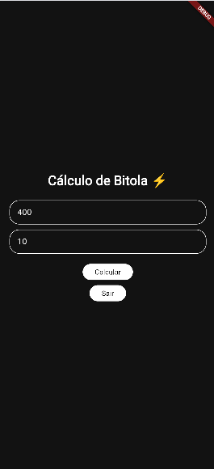
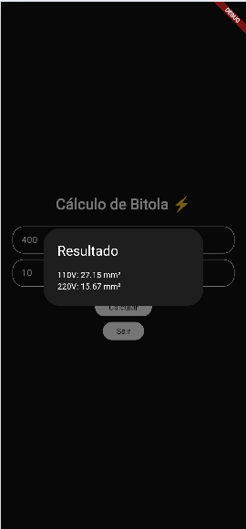

# Calculadora de Bitola de Fios ⚡

## 📌 Descrição do projeto
No contexto das instalações elétricas, é fundamental escolher corretamente a bitola dos fios para garantir segurança e eficiência.

Este aplicativo, desenvolvido em Flutter, permite calcular a bitola adequada de um fio elétrico com base em:
- Corrente elétrica (A)
- Distância (m)

O app exibe o resultado da bitola recomendada para a instalação.

---

## 🎨 Protótipo no Figma
[Clique para ver!](https://www.figma.com/proto/U1A9McP3djVE1cVHPHR9mA/Untitled?node-id=2-2)

---

## 📸 Prints das telas

<table align="center">
  <tr>
    <td align="center">
      <br>
      Tela Inicial
    </td>
    <td align="center">
      <br>
      Cálculo
    </td>
    <td align="center">
      <br>
      Resultado
    </td>
  </tr>
</table>

---

## 🚀 Tecnologias
- Flutter
- Dart

---

## ▶️ Como executar

1. Clone o repositório:
```bash
git clone https://github.com/IsabelleBorges26/Bitola_Flutter.git
Acesse a pasta do projeto:
cd Bitola_Flutter
Instale as dependências:
flutter pub get
Execute o projeto:
flutter run
